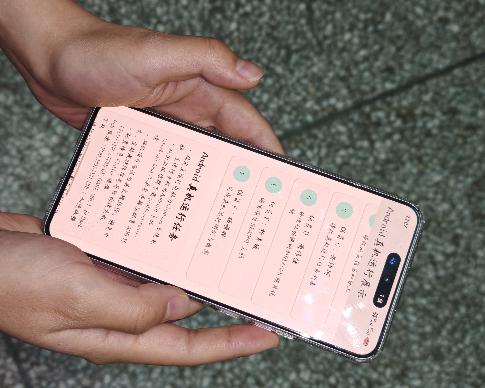
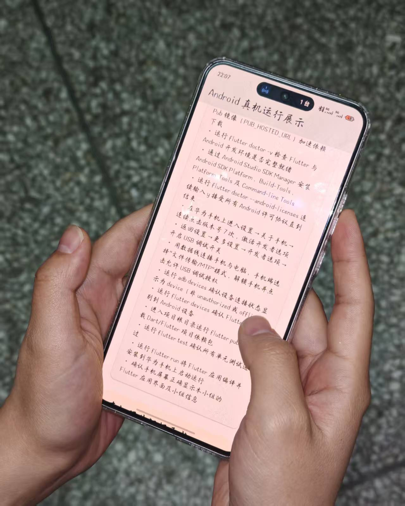

# 小组 Flutter Android 真机运行展示项目

本项目用于第15周 GitHub 小组协作与 Flutter Android 真机运行练习。

本案例只使用一种协作方式：**组长创建原始仓库，组员 Fork 后提交 Pull Request，组长审核并合并**。组员不直接 push 组长仓库的 `main` 分支，也不要求组长把组员加入 collaborator。

本项目不是为了比拼复杂功能，而是一个"小组协作成果展示应用"。每名组员只需要修改一个区域，目标是留下 GitHub 协作痕迹，并让最终成果在真实 Android 手机上运行。

## 项目目标

小组需要完成：

1. 组长创建 GitHub 原始仓库并上传本项目。
2. 组员 Fork 组长仓库。
3. 每名组员在自己的 Fork 中创建分支并修改指定内容。
4. 组员通过 Pull Request 请求合并。
5. 组长审核并合并 PR。
6. 小组选出一台主电脑和一台 Android 手机。
7. 在真实 Android 手机上运行 Flutter 应用。
8. 用第二部手机拍摄手持真机运行照片。
9. 把照片发到小组，并加入本 README。

## 课堂下载与环境准备

课堂下载页：

```text
http://10.50.2.92/course-mobile-week15/
```

下载页提供 Android Studio、Flutter SDK、Android Platform-Tools、Android Command-line Tools 和 `checksums.sha256`。课堂优先保障一台主电脑跑通。如果下载速度较慢，可以组内或组间使用 U 盘、移动硬盘或局域网共享互相拷贝。拷贝后仍必须在本机运行检查命令。

## 运行前避坑清单

开始运行前先检查：

- Flutter SDK 和本项目路径尽量使用短英文路径，例如 `C:\dev\flutter` 和 `C:\dev\group_flutter_android_demo`，不要放在中文、空格或特殊符号路径下。
- GitHub 推送不能使用账号密码直接认证；如果 `git push` 报 password authentication removed，请使用 GitHub Desktop、Git Credential Manager 或个人访问令牌。
- 组长创建 GitHub 仓库时要创建空仓库，不要勾选 README、`.gitignore` 或 license。
- 手机连接电脑后，USB 模式选择文件传输 / MTP / 传输文件，并在手机上允许 USB 调试。
- 第一次 `flutter run` 卡在 `Running Gradle task 'assembleDebug'` 时，可能是在下载 Gradle 或 Maven 依赖，先让主电脑完成一次构建，不要全组同时重复下载。
- 真机照片建议压缩到 2MB 到 5MB 左右，README 图片路径大小写要和文件名完全一致。

## 运行要求

进入项目根目录后执行：

```bash
flutter pub get
flutter test
flutter run
```

如果有多台设备，先查看设备：

```bash
flutter devices
```

再指定 Android 设备运行：

```bash
flutter run -d 设备ID
```

## Android 真机连接检查

连接 Android 手机后，建议先检查：

```bash
adb devices
flutter devices
```

`adb devices` 中设备状态必须是：

```text
device
```

如果是 `unauthorized`，请解锁手机并点击允许 USB 调试。

## 小组成员与分工

| 角色 | 姓名 | 任务 | 负责区域 |
| --- | --- | --- | --- |
| 组长 | 王怡婷 | 创建仓库、维护 main、审核 PR、组织真机运行 | GitHub 仓库管理 |
| 组员 A | 陈嘉玲 | 修改应用标题和项目口号 | `lib/main.dart` → `projectTitle` / `projectSlogan` |
| 组员 B | 廖春花 | 修改成员信息和分工 | `lib/main.dart` → `members` |
| 组员 C | 岳沛珂 | 修改真机运行任务列表 | `lib/main.dart` → `androidTasks` |
| 组员 D | 周伟佳 | 修改证据说明和 README 照片说明 | `lib/main.dart` → `evidenceNotes` |
| 组员 E | 杨美媛 | 编写项目 README 文档 | `README.md` |
| 组员 F | 杨顺粉 | 完成真机运行测试与截图 | 真机运行 + `images/android-real-device1.jpg` 等 4 张 |

## 协作流程记录

| 步骤 | 操作 | 执行人 | 状态 |
| --- | --- | --- | --- |
| 1 | 创建组长仓库 `yitingw159/flutter-android-demo` | 王怡婷 | ✅ 完成 |
| 2 | 全体组员 Fork 仓库 | 全体组员 | ✅ 完成 |
| 3 | 组员B 提交成员信息 PR #3 | 廖春花 | ✅ 已合并 |
| 4 | 组员E 提交 README 文档 PR | 杨美媛 | ✅ 已合并 |
| 5 | 组员F 提交真机运行照片 PR | 杨顺粉 | 🔄 进行中 |
| 6 | 其余组员提交各自代码 PR | 各组员 | ⏳ 待完成 |
| 7 | 合并全部 PR | 王怡婷 | ⏳ 待完成 |

## Android 真机运行效果

完成真机运行后，把照片保存为：

```text
images/android-real-device1.jpg
images/android-real-device2.jpg
images/android-real-device3.jpg
images/android-real-device4.jpg
```

然后在 README 中引用：

```markdown




```

照片必须满足：

- ✅ 真实 Android 手机正在运行本 Flutter 应用。
- ❌ 不能是 Web 截图。
- ❌ 不能是手机直接截图。
- ✅ 必须由第二部手机拍摄。
- ✅ 必须拍到手持手机。
- ✅ 不能包含明显隐私信息。

### 本组真机运行效果


